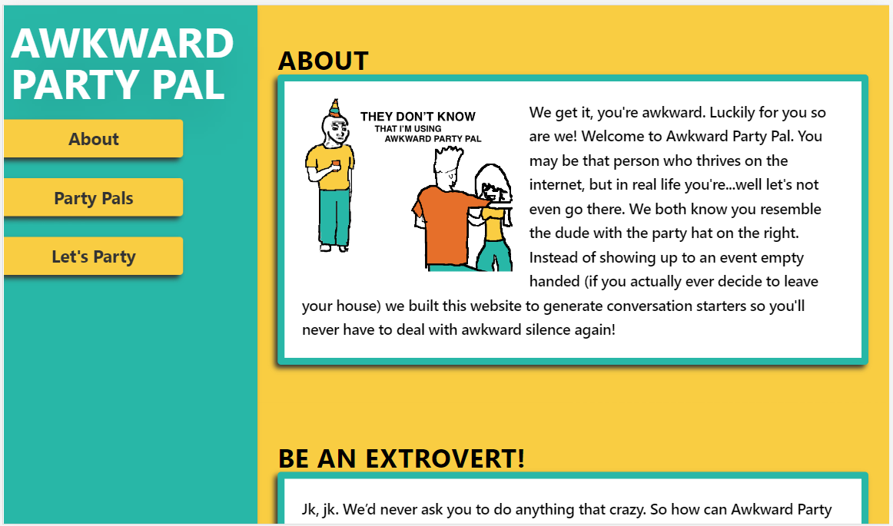

# Awkward Party Pal

## User Story
```md
AS A socially awkward person
I WANT an app that helps me navigate social situations
SO THAT I can build meaningful relationships
```

## Purpose
* A web application made to assist the socially awkward at social gatherings.
* Encourages/allows users to create individual party guest profiles.
* Displays user notes in an easy to reference format.
* API integrations allow users to generate random conversation starters and Kanye quotes.

## Built With
* HTML
* JavaScript
* Tailwind
* CSS
* Kanye Rest API
* API Ninjas - Facts API

## Website
**Link to deployed Github page ➝** [Awkward Party Pal](https://abbygraves.github.io/awkward-party-pal/)



## Featuring
Digital Art by Rafaël Rozendaal - jellotime.com

## Made with 🎉 by The Eternal Codesters

- - - 

Copyright © 2022 The Eternal Codesters

Redistribution and use in source and binary forms, with or without modification, are permitted provided that the following conditions are met:

1. Redistributions of source code must retain the above copyright notice, this list of conditions and the following disclaimer.
2. Redistributions in binary form must reproduce the above copyright notice, this list of conditions and the following disclaimer in the documentation and/or other materials provided with the distribution.
Subject to the terms and conditions of this license, each copyright holder and contributor hereby grants to those receiving rights under this license a perpetual, worldwide, non-exclusive, no-charge, royalty-free, irrevocable (except for failure to satisfy the conditions of this license) patent license to make, have made, use, offer to sell, sell, import, and otherwise transfer this software, where such license applies only to those patent claims, already acquired or hereafter acquired, licensable by such copyright holder or contributor that are necessarily infringed by:

(a) their Contribution(s) (the licensed copyrights of copyright holders and non-copyrightable additions of contributors, in source or binary form) alone; or
(b) combination of their Contribution(s) with the work of authorship to which such Contribution(s) was added by such copyright holder or contributor, if, at the time the Contribution is added, such addition causes such combination to be necessarily infringed. The patent license shall not apply to any other combinations which include the Contribution.
Except as expressly stated above, no rights or licenses from any copyright holder or contributor is granted under this license, whether expressly, by implication, estoppel or otherwise.

DISCLAIMER

THIS SOFTWARE IS PROVIDED BY THE COPYRIGHT HOLDERS AND CONTRIBUTORS "AS IS" AND ANY EXPRESS OR IMPLIED WARRANTIES, INCLUDING, BUT NOT LIMITED TO, THE IMPLIED WARRANTIES OF MERCHANTABILITY AND FITNESS FOR A PARTICULAR PURPOSE ARE DISCLAIMED. IN NO EVENT SHALL THE COPYRIGHT HOLDERS OR CONTRIBUTORS BE LIABLE FOR ANY DIRECT, INDIRECT, INCIDENTAL, SPECIAL, EXEMPLARY, OR CONSEQUENTIAL DAMAGES (INCLUDING, BUT NOT LIMITED TO, PROCUREMENT OF SUBSTITUTE GOODS OR SERVICES; LOSS OF USE, DATA, OR PROFITS; OR BUSINESS INTERRUPTION) HOWEVER CAUSED AND ON ANY THEORY OF LIABILITY, WHETHER IN CONTRACT, STRICT LIABILITY, OR TORT (INCLUDING NEGLIGENCE OR OTHERWISE) ARISING IN ANY WAY OUT OF THE USE OF THIS SOFTWARE, EVEN IF ADVISED OF THE POSSIBILITY OF SUCH DAMAGE.


